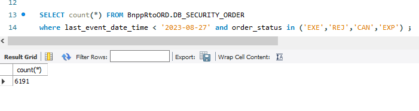
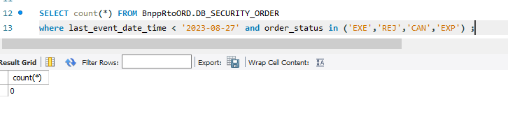
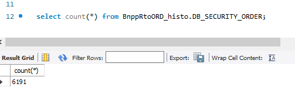
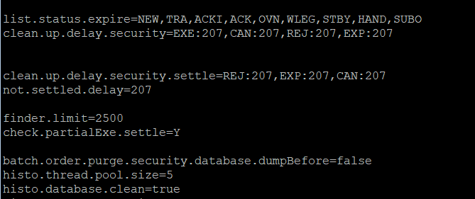

<div style="text-align:justify;">

# Comptes-rendus hebdomadaires
 
 Nom: **Petit** \
 Prénom: **Gwénaël**

 Entreprise: **WorldLine** 

*******
<h2>Table des matières</h2>  

 1. [Semaine du 11/03 au 15/03](#semaine-du-1103-au-1503)     
 2. [Semaine du 18/03 au 22/03](#semaine-du-1803-au-2203)

*******

## Semaine du 11/03 au 15/03
Résumé de la mission : Mission de prise en main de l'environnement de travail consistant à mettre à jour un script permettant d'afficher l'état des différents processus sur un serveur.


### Ce que j'ai fait:

* Le lundi et mardi matin ont été consacrés à la configuration du poste de travail. J'ai dû installer et configurer des logiciels tels que Putty, MySQL Workbench et Eclipse. J'ai aussi pu prendre en main des outils utilisés par l'entreprise, comme Confluence et Jira.
* Durant les premiers jours, mon objectif était de comprendre le fonctionnement et les caractéristiques du produit TOM (Trade Order Management) sur lequel je vais travailler. Pour cela, j'ai consulté la documentation relative au projet, et le Product Manager m'a fait une présentation détaillée du produit ainsi que de l'organisation de l'entreprise pour ce projet.
* À partir de mercredi, j'ai pu commencer à travailler sur ma première mission, qui consiste à mettre à jour un service permettant d'afficher l'état des services sur un serveur. Voir [détail mission](#détail-mission-1).\
Cette mission m'a permis de prendre en main OPS, un outil interne de **Worldline** qui permet de configurer et de déployer des services sur des serveurs.

### Ce que j'ai appris:

* J'ai découvert plus en détail le fonctionnement d'une équipe informatique au sein d'une entreprise de cette envergure. Le projet rassemble plusieurs équipes, chacune comprenant un certain nombre de collaborateurs, ce qui nécessite une communication efficace, prenant ainsi plus de temps que je ne l'imaginais dans le travail d'un développeur.

* J'ai appris à configurer et déployer un service avec OPS et découvert comment l'entreprise utilise gitlab pour ses déploiements.

* Cette semaine était une semaine d'adaptation et au delà des compétences techniques, l'apprentissage concernait surtout la prise en main de l'environnement de travail et l'adapation à l'entreprise. J'ai par exemple participé à des réunions journalières avec mon équipe pour partager nos avancées.

### Difficultés rencontrées:

* Le produit TOM est assez complexe et concerne un domaine pour lequel j'ai encore peu de connaissances (la finance). J'ai donc passé une partie de mon temps à lire de la documentation pour comprendre son fonctionnement et son utilité.

* Il m'a fallu un peu de temps pour comprendre comment le déploiement fonctionnait, en effet, lors du premier déploiement, j'ai eu différents problèmes concernant les chemins d'accès, que j'avais mal configuré.

### Programme pour la semaine prochaine:

* Lundi sera consacré au déploiement du service sur tous les serveurs.
* J'ai une réunion lundi pour en savoir plus sur ma prochaine mission.

#### Détail Mission 1:

> Résultat actuel du script actuel:
>
>

La modification demandée consiste à afficher des noms plus significatifs (pour l'instant, seul le nom renvoyé lorsqu'on exécute "ps -f" est affiché) et à afficher la date du dernier lancement du serveur.

Les informations nécessaires pour un service sont récupérées à partir d'un fichier CSV. On y récupère leur nom, l'heure de démarrage, l'heure d'arrêt, les jours de démarrage et les jours d'arrêt.

Un script permettant de récupérer ces informations a déjà été développé par une autre équipe, il faut donc configurer notre service pour utiliser leur script.

><u>3 étapes:</u>
>* Mettre à jour le csv (rajouter une colonne avec un label)
>* Mettre à jour un fichier `utils` qui définie des fonctions necessaires au script (renommer ces fonctions)
>* Configurer le service à l'aide d'un logiciel interne appelé OPS.
>

##### 1.
La mise à jour du CSV consiste juste à rajouter une colonne et les réorganiser.

##### 2.
Le fichier `utils` contenant plus de 300 fonctions, il serait trop long de toutes les renommer une par une, surtout qu'il suffit de leur ajouter un preffix `"cop_"`.
On utilise donc commande sed, dont voici un exemple.
```
sed -i "s/^r/cop_r/g" utils
```

##### 3.
La configuration du service sur OPS est la partie la plus complexe, puisque je n'avais jamais utilisé OPS avant.
Il faut donc ajouter une ressource dans le module `"Monitoring"`, qu'on appelle `"monitoring-test"`, puis ajouter les serveurs sur lesquels on souhaite la déployer.
Entuite, on définit notre configuration en se basant sur le template de la configuration faite par l'équipe qui a développé les scripts utilisés puis on adapte les variables comme dans la configuration ci-dessous. 

Configuration:

*configuartion du déploiement du service*

#### Conclusion
Une fois le déploiement terminé, on peut essayer la commande qui donne le résultat suivant.  

  

Un service d'envoi de mails utilise celui que l'on vient de mettre à jour, il faut donc vérifier qu'il fonctionne toujours (c'est le cas).

On déploie ensuite sur tous les serveurs et la mission est terminée.

---
## Semaine du 18/03 au 22/03
 Résumé de la mission : Mettre en place un service d'archivage et de purge des ordres financiers le service existe, il faut le tester, le déployer et le configurer pour qu'il soit exécuté automatiquement.


### Ce que j'ai fait:

 * La semaine a commencé par un prolongement de la mission de la semaine précédente. Après avoir déployé la nouvelle version du service **stat_serv** la semaine dernière, j'ai pu effectuer la même opération pour les services permettant de démarrer, arrêter ou redémarrer les processus lancés sur un serveur. Ces services font partie du même dépôt GitLab et sont en réalité déjà déployés, mais non utilisés (nous avons déployé toute la branche 1.0 du dépôt). Il suffit donc de mettre à jour les chemins d'accès pour ces services dans notre fichier `utils` (voir le [détail de la mission](#détail-mission-1) de la semaine précédente).<br>
 Lors du test des différentes commandes, j'ai remarqué que les commandes `restart_all` et `restart_all_force` ne fonctionnaient pas. Leurs scripts respectifs n'avaient pas été adaptés au nouveau format du fichier CSV, modifié la semaine dernière. Il a fallu ajuster les commandes `cut` qui ne renvoyaient plus les bonnes colonnes du fichier.<br>
 Cependant, un membre de l'équipe m'a fait remarquer que les deux scripts étaient très similaires. Il m'a donc suggéré de créer un script commun pour les deux services. J'ai donc développé une fonction `restart_all_process` prenant un booléen ***force*** en paramètre. Cela permet d'avoir un code plus concis et d'éviter la redondance.
<br>

 * J'ai eu une réunion lundi pour découvrir ma seconde mission, qui concerne l'historisation des ordres financiers et la purge des bases de données. Cela permet de réduire le volume de données sur les bases où des opérations fréquentes sont effectuées, afin d'accélérer les traitements.   
 Pour cela, il y a des scripts déjà déployés sur les serveurs, mais inutilisés. Il est nécessaire de paramétrer une exécution automatique de ces scripts afin qu'ils s'exécutent régulièrement en dehors des heures d'activité. 
 -> [Détail de la mission](#détail-mission-2)  <br>
 Avant de commencer la mission, j'ai dû lire le code existant pour comprendre le fonctionnement du service. Le service ayant été développé il y a un certain temps mais non utilisé, j'ai vérifié que le schéma des tables de destination correspondait à celui des tables sources. J'ai corrigé quelques différences de type de colonnes (ex: date et datetime).  <br>
 J'ai ensuite testé le programme pour vérifier s'il fonctionnait sans bug et donnait le résultat attendu avant de le déployer. Cela m'a aussi permis de comprendre le fonctionnement de certains paramètres nécessaires pour le déploiement. J'ai d'abord testé le service d'historisation sans purge pour éviter la suppression de données non sauvegardées en cas d'échec (sur environnement de développement, pour éviter de réintroduire les données après chaque test). Tout fonctionnait, donc j'ai ensuite testé avec la purge et obtenu le résultat suivant.

>-----
> 
> *Table des ordres, avant purge:*
> 
> 
> *Table des ordres, après purge:*
>
>
> *Table des ordres archivés, après archivage:*

### Ce que j'ai appris:

 * j'ai dû analyser le code existant afin de l'améliorer, ce que je n'ai pas l'habitude de faire pour un code qui n'est pas le mien. Cela m'a également poussé à programmer en C, langage que je n'avais pas utilisé depuis un certain temps.

 * Analyser un code complexe dans le cadre des tests pour l'archivage et la purge des ordres.

### Difficultés rencontrées:
 
 * Le service d'historisation est plutôt complexe. Il s'agit d'un service développé en Spring, exécuté via un script en C. Le code est réparti dans plusieurs dépôts GitLab et gère 2 bases de données distinctes. Avant de le configurer, j'ai dû consacrer beaucoup de temps à comprendre en détail son fonctionnement.


### Programme pour la semaine prochaine:</h3>

* 

#### Détail Mission 2

>L'historisation et la purge de tables permet de libérer de l'espace dans les bases de données utilisés par les services afin de maintenir un niveau de performances élévé, tout en gardant les anciennes donées sur d'autre tables, afin de respecter les lois conernant l'accés au données (pendant 7 ans).
>
> L'objectif est d'archiver tous les ordres financiers qui n'ont reçu aucune modification depuis un nombre de jour défini dans la configuration, dans notre cas, ce sera 1 an, donc 365.
>
> L'aboressence déployée est la suivante:
>```
>purge
>   ├── logs
>   └── security
>   ├── conf
>   │   ├── classpath.txt
>   │   ├── log4j.properties
>   │   ├── maven
>   │   ├── pom.xml
>   │   ├── securityOrderCleanAndExpire.ini
>   │   ├── target
>   │   └── wts_archive.conf
>   ├── etc
>   │   ├── securityOrderClean.ksh
>   │   └── securityOrderExpire.ksh
>   └── properties
>       ├── oms
>       │   └── common
>       │       └── services
>       │           └── WTSServicesLauncher.properties
>       └── spring
>           └── applicationContext-order.xml
>```
> Le fichier `securityOrderClean.ksh` contient le srcipt principal du service et utilise le fichier de configuration `securityOrderCleanAndExpire.ini`
>
> Le fichier de configuration définie la durée le nombre de jour necessaire avant la purge d'un ordre selon son statut. Dans notre cas, on purge tous les odres au bout d'un an, on met donc toutes les valeur à 365 (on mettra ces valeurs à 207 pour nos tests, nombre de jours écoulés depuis les premiers ordres effectués).
>
>
>

</div>