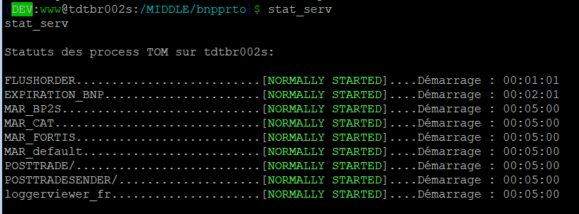
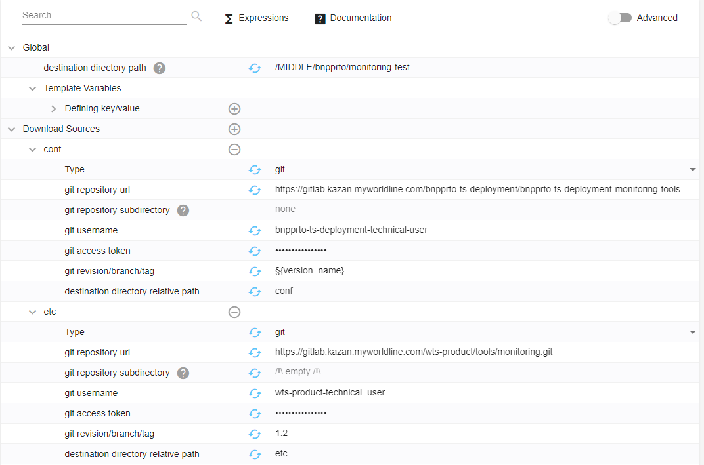
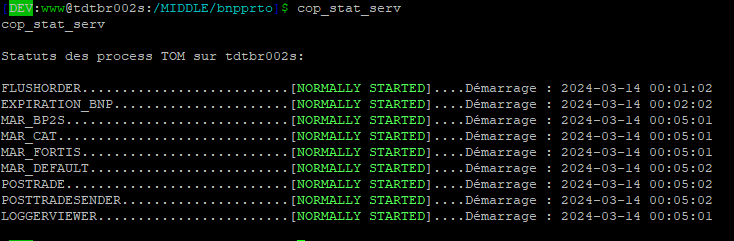

# Comptes-rendus hebdomadaires
 
 Nom: **Petit** \
 Prénom: **Gwénaël**

 Entreprise: **WorldLine** \
 Résumé de la mission: Petite mission pour prendre en main l'environnement de travail: mettre à jour un petit script permettant d'afficher l'état des différents processus sur un serveur.

 <h2>Semaine du 11/03 au 15/03</h2>


 <h3> Ce que j'ai fait:</h3>

 * Le lundi et mardi matin ont été consacrés à la configuration du poste de travail. J'ai dû installer et configurer des logiciels tels que Putty, MySQL Workbench et Eclipse. J'ai aussi pu prendre en main des outils utilisés par l'entreprise, comme Confluence et Jira.
 * Durant les premiers jours, l'objectif était pour moi de comprendre le fonctionnement et la caractéristique du produit TOM (Trade Order Managment) sur lequel je vais travailler. J'ai pour cela lu de la documentation sur le projet, et le Product Manager m'a fait une présentation détaillée du produit ainsi que de l'organisation de l'entreprise pour ce projet.
 * À partir de mercredi, j'ai pu commencer à travailler sur ma première mission, qui consiste à mettre à jour un service permettant d'afficher l'état des services sur un serveur. Voir [détail mission](#détail-mission).\
 Cette mission m'a permis de prendre en main OPS, un outil interne de **Worldline** qui permet de configurer et de déployer des services sur des serveurs.

 <h3> Ce que j'ai appris:</h3>

 * J'ai découvert plus en détail le fonctionnement d'une équipe informatique au sein d'une entreprise de cette envergure. Le projet rassemble plusieurs équipes, chacune comprenant un certain nombre de collaborateurs, ce qui nécessite une communication efficace, prenant ainsi plus de temps que je ne l'imaginais dans le travail d'un développeur.

 * J'ai appris à configurer et déployer un service avec OPS et découvert comment l'entreprise utilise gitlab pour ses déploiements.

 * Cette semaine était une semaine d'adaptation et au delà des compétences techniques, l'apprentissage concernait surtout la prise en main de l'environnement de travail et l'adapation à l'entreprise. J'ai par exemple participé à des réunions journalières avec mon équipe pour partager nos avancées.

 <h3> Difficultés rencontrés:</h3>
 
 * Le produit TOM est assez complexe et concerne un domaine pour lequel j'ai en core peu de connaissances (la finance). J'ai donc passé une partie de mon temps à lire de la documentation pour comprendre son fonctionnement et son utilité.

 * Il m'a fallu un peu de temps pour comprendre comment le déploiment fonctionnait, en effet, lors du premier déploiment, j'ai eu différents problème concernant les chemins d'accès, que j'avais mal configuré.

 <h3> Programme pour la semaine prochaine:</h3>


#### Détail Mission:

> Résultat actuel du script actuel:
>
>

La modification demandée consiste à afficher des noms plus clairs (pour l'instant, seul le nom renvoyé lorsqu'on exécute "ps -fu" est affiché) et à afficher la date du dernier lancement du serveur.

Les informations nécessaires pour un service sont récupérées à partir d'un fichier CSV. On y récupère leur nom, l'heure de démarrage, l'heure d'arrêt, les jours de démarrage et les jours d'arrêt.

Un script permettant de récupérer ces informations a déjà été développé par une autre équipe, il faut donc configurer notre service pour utiliser leur script.

><u>3 étapes:</u>
>* Mettre à jour le csv (rajouter une colonne avec un label)
>* Mettre à jour un fichier `utils` qui définie des fonctions necessaires au script (renommer ces fonctions)
>* Configurer le service à l'aide d'un logiciel interne appelé OPS.
>

##### 1.
La mise à jour du CSV consiste juste a rajouter une colonne et les réorganiser.

##### 2.
Le fichier `utils` contenant plus de 300 fonctions, il serait trop long de toutes les renommer une par une, surtout qu'il suffit de leur ajouter un preffix `"cop_"`.
On utilise donc commande sed, dont voici un exemple.
```
sed -i "s/^r/cop_r/g" utils
```

##### 3.
La configuration du service sur OPS est la partie la plus complexe, puisque je n'avais jamais utilisé OPS avant.
Il faut donc ajouter une ressource dans le module `"Monitoring"`, qu'on appelle `"monitoring-test"`, puis ajouter les serveurs sur lesquels on souhaite la déployer.
Entuite, on définie notre configuration en se basant sur le template de la configuration faite par l'équipe qui a développé les scripts utilisés puis on adapte les variables. 

Configuration:


##### conclusion
Une fois le déploiment terminé, on peut essayer la commande qui donne le résultat suivant.

On déploie ensuite sur tous les serveurs et la mission est terminée.